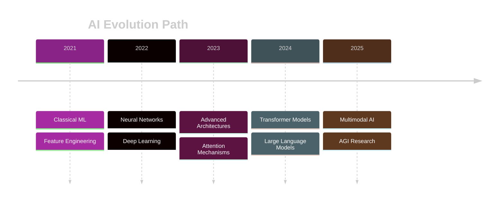

<!-- INNOVATIVE COSMIC AI EXPLORER THEME -->

  

<!-- ANIMATED CONSTELLATION EFFECT -->

  

<!-- NEURAL NETWORK NAVIGATOR -->
<h2 align="center">🧬 N E U R A L &nbsp; N E T W O R K &nbsp; N A V I G A T O R 🧬</h2>

  <table>
    <tr>
      <td align="center">
        
      </td>
      <td align="center">
        
      </td>
      <td align="center">
        
      </td>
      <td align="center">
        
      </td>
      <td align="center">
        
      </td>
    </tr>
  </table>

<!-- DIGITAL SIGNATURE -->

  

<!-- INTERACTIVE TERMINAL SHOWCASE -->

  
  <pre width="100%">
mandrita@neural-lab:~/ai-research$ neural-profile --interactive

LOADING NEURAL IDENTITY...
■■■■■■■■■■■■■■■■■■■■ 100%

[CORE IDENTITY]
Name: Mandrita Dasgupta
Focus: Creating intelligent systems that understand human cognition
Mission: Building technology that augments human potential

[RESEARCH DOMAINS]
➤ Transformer Architecture Evolution
➤ Self-Supervised Learning Systems
➤ Multimodal Intelligence Frameworks
➤ Neural Scaling Dynamics

[NEURAL SIGNATURE]
"Where algorithms meet consciousness - that's where the future begins"

mandrita@neural-lab:~/ai-research$ _
  </pre>

<!-- NEURAL NETWORK VISUALIZATION -->
<h2 align="center">🧠 NEURAL ARCHITECTURE 🧠</h2>

  <table border="0" cellspacing="0" cellpadding="0">
    <tr>
      <td>
        
Input Layer

      </td>
      <td>⟶</td>
      <td>
        
Hidden Layer 1

      </td>
      <td>⟶</td>
      <td>
        
Hidden Layer 2

      </td>
      <td>⟶</td>
      <td>
        
Output Layer

      </td>
    </tr>
    <tr>
      <td align="center">Computer Vision</td>
      <td></td>
      <td align="center">Transformer</td>
      <td></td>
      <td align="center">Attention</td>
      <td></td>
      <td align="center">Insights</td>
    </tr>
  </table>

<!-- HOLOGRAPHIC TECH STACK -->
<h2 align="center">🌌 QUANTUM TECH STACK 🌌</h2>

  <table border="0">
    <tr>
      <td align="center" width="150px">
        
         
        
Tensor Manipulation Autograd Neural Networks

      </td>
      <td align="center" width="150px">
        
         
        
Keras Integration Distributed Training TF Serving

      </td>
      <td align="center" width="150px">
        
         
        
BERT/GPT/T5 Fine-tuning Transfer Learning

      </td>
      <td align="center" width="150px">
        
         
        
Auto-differentiation JIT Compilation Parallel Processing

      </td>
    </tr>
    <tr>
      <td align="center" width="150px">
        
         
        
Distributed Training Multi-GPU Research Workflow

      </td>
      <td align="center" width="150px">
        
         
        
Distributed Compute Ray Tune Ray Serve

      </td>
      <td align="center" width="150px">
        
         
        
Model Exchange Interoperability Deployment

      </td>
      <td align="center" width="150px">
        
         
        
Inference Server Multi-Framework Dynamic Batching

      </td>
    </tr>
  </table>

<!-- 3D RESEARCH SPHERES -->
<h2 align="center">🔮 RESEARCH DIMENSIONS 🔮</h2>

  <table cellpadding="20">
    <tr>
      <td align="center">
        

          

            <strong>TRANSFORMER EVOLUTION</strong>
          

        

      </td>
      <td align="center">
        

          

            <strong>MULTIMODAL INTELLIGENCE</strong>
          

        

      </td>
      <td align="center">
        

          

            <strong>SELF-SUPERVISED LEARNING</strong>
          

        

      </td>
    </tr>
    <tr>
      <td align="center">Attention Optimization Sparse Transformers Efficient Architectures</td>
      <td align="center">Vision-Language Models Audio-Text Integration Cross-Modal Transfer</td>
      <td align="center">Contrastive Learning Masked Auto-Encoding Generative Pretraining</td>
    </tr>
  </table>

<!-- BRAIN WAVE STATS -->
<h2 align="center">📊 NEURAL ACTIVITY METRICS 📊</h2>

  <table border="0" cellspacing="0" cellpadding="0">
    <tr>
      <td width="50%">
        
      </td>
      <td width="50%">
        
      </td>
    </tr>
  </table>

<!-- NEURAL EXPERTISE VISUALIZATION -->
<h2 align="center">🧮 NEURAL EXPERTISE MATRIX 🧮</h2>

  <table border="0" cellspacing="0" cellpadding="0">
    <tr>
      <td>
        
<strong style="color: #8A2387;">Deep Learning</strong>

        

          

            95%
          

        

      </td>
    </tr>
    <tr>
      <td>
        
<strong style="color: #8A2387;">Natural Language Processing</strong>

        

          

            90%
          

        

      </td>
    </tr>
    <tr>
      <td>
        
<strong style="color: #8A2387;">Computer Vision</strong>

        

          

            85%
          

        

      </td>
    </tr>
    <tr>
      <td>
        
<strong style="color: #8A2387;">Reinforcement Learning</strong>

        

          

            80%
          

        

      </td>
    </tr>
    <tr>
      <td>
        
<strong style="color: #8A2387;">MLOps & Deployment</strong>

        

          

            75%
          

        

      </td>
    </tr>
  </table>

<!-- TIMELINE VISUALIZATION -->
<h2 align="center">⏳ NEURAL TIMELINE ⏳</h2>

<!-- HOLOGRAPHIC PROJECT SHOWCASES -->
<h2 align="center">🌠 NEURAL CREATIONS 🌠</h2>

  

    <h3 style="color: #E94057;">🧬 NeuroEvolution Framework</h3>
    
A novel architecture for self-evolving neural networks that adapt to new data patterns without explicit retraining.

    

      PyTorch
      Genetic Algorithms
      AutoML
    

  

  
  

    <h3 style="color: #E94057;">🔮 MultiModal Fusion Engine</h3>
    
Advanced framework for integrating vision, language, and audio understanding in a unified cognitive model.

    

      Transformers
      JAX
      CLIP
    

  

  

    <h3 style="color: #E94057;">⚡ Quantum NLP Pipeline</h3>
    
Experimental framework exploring quantum computing principles for natural language understanding tasks.

    

      Qiskit
      BERT
      PennyLane
    

  

  
  

    <h3 style="color: #E94057;">🔄 Self-Learning Agent</h3>
    
Autonomous agent that continuously improves through interaction with dynamic environments.

    

      Ray RLlib
      PPO
      Meta-Learning
    

  

<!-- NEURAL NETWORK CONTACT PORTAL -->
<h2 align="center">📡 NEURAL TRANSMISSION CHANNELS 📡</h2>

  
  
  
  

<!-- ANIMATED FOOTER -->

  <img src="https://capsule-render.vercel.app/api?type=waving&color=gradient&customColorList=0,2,2,5,30&he