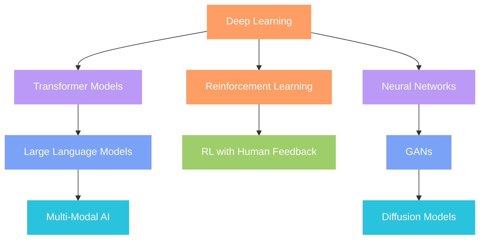

# 
👾 Mandrita Dasgupta

  <!-- Top Wave Animation -->
  

  

  <i>Decoding the future of intelligence, one neural network at a time 🧠</i>

 

## 🤖 About Me

- 🎓 Pursuing CS Engineering at Heritage Institute of Technology
- 🧪 Conducting experiments at the intersection of AI and human cognition
- 🌌 Fascinated by the possibilities of Artificial General Intelligence
- 🔮 Building intelligent systems that understand human language
- 🚀 On a mission to push the boundaries of what machines can learn

## 🧠 Core Tech Stack

### AI & Machine Learning

### NLP & Data Science

### Deep Learning

### Cloud & MLOps

### Web Development

## 🔥 Current Projects

- 🧠 Building a transformer-based model for emotion detection in text
- 🔍 Developing a question-answering system using NLP techniques  
- 🌐 Creating a web application that leverages machine learning for personalized recommendations
- 🤖 Exploring reinforcement learning approaches for autonomous decision-making

## 🌟 What I'm Learning

## 💬 Let's Talk AI

## 📊 GitHub Analytics

  

  
  

  

  <!-- Bottom Wave Animation with gradient fill -->
  

---

  

