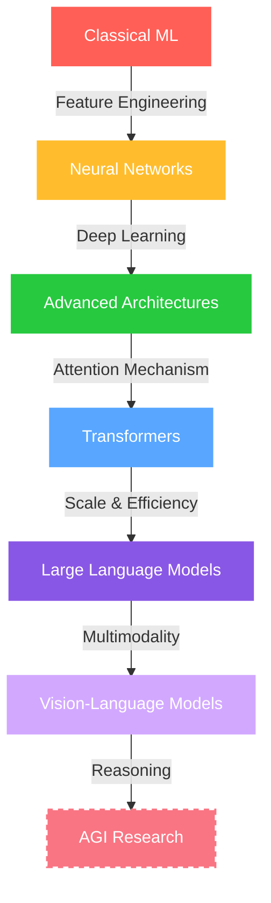

<div align="center">
  
</div>

<div align="center">
  
  
</div>

<div align="center">
  <a href="https://www.linkedin.com/in/mandrita-dasgupta-00a8a428b">
    
  </a>
  <a href="https://twitter.com/mandrita16">
    
  </a>
  <a href="mailto:mandritadasgupta16@gmail.com">
    
  </a>
  <a href="https://github.com/mandrita16">
    
  </a>
</div>


## 🤖 About Me

```python
class MandritaDasgupta:
    def __init__(self):
        self.name = "Mandrita Dasgupta"
        self.education = "CS Engineering @ Heritage Institute"
        self.interests = ["Artificial General Intelligence", 
                          "Natural Language Processing", 
                          "Neural Networks", 
                          "Deep Learning"]
        self.research_focus = "Creating intelligent systems that understand human cognition"
        self.work_philosophy = "Building AI that augments human potential"
        
    def current_ventures(self):
        return "Pushing the boundaries of transformer architectures and multimodal models"
        
    def life_mission(self):
        return "Advancing the field of AI to create systems that benefit humanity"
        
    def quote(self):
        return "The future belongs to those who bridge the gap between human and artificial intelligence"
```

## 🧠 AI & ML Tech Arsenal

<div align="center">
  <table>
    <tr>
      <td valign="top" width="33%">
        <h3 align="center">🔬 Machine Learning</h3>
        <div align="center">  
            
            
            
          
          
          
        </div>
      </td>
      <td valign="top" width="33%">
        <h3 align="center">📊 NLP & Data</h3>
        <div align="center">  
            
            
          
            
          
          
        </div>
      </td>
      <td valign="top" width="33%">
        <h3 align="center">☁️ Web & Cloud</h3>
        <div align="center">  
            
            
          
          
          
          
        </div>
      </td>
    </tr>
  </table>
</div>

## 🚀 Current AI Explorations

<div align="center">
  
</div>

<div align="center">
  <table>
    <tr>
      <td>
        <h3>🧠 Neural Architecture Design</h3>
        <p>Pioneering novel architectural patterns for efficient deep learning</p>
      </td>
      <td>
        <h3>🔮 Self-Supervised Learning</h3>
        <p>Developing frameworks that learn without labeled data</p>
      </td>
    </tr>
    <tr>
      <td>
        <h3>🌐 Multimodal Intelligence</h3>
        <p>Fusing visual, textual and audio understanding in unified models</p>
      </td>
      <td>
        <h3>🤖 Reinforcement Learning</h3>
        <p>Building systems that learn from interaction and feedback</p>
      </td>
    </tr>
    <tr>
      <td>
        <h3>🔍 Attention Mechanisms</h3>
        <p>Advancing contextual understanding in language models</p>
      </td>
      <td>
        <h3>🌟 Responsible AI</h3>
        <p>Embedding ethical considerations into AI system design</p>
      </td>
    </tr>
  </table>
</div>

## 📊 My AI Journey Visualization



## 💻 GitHub Analytics

<div align="center">
  
</div>

<div align="center">
  
</div>

<div align="center">
  
</div>

<!-- AI SKILLS PROGRESS BARS -->
<h2 align="center">🧠 AI Expertise Levels</h2>
<div align="center">
  <div style="display: flex; align-items: flex-start; justify-content: center;">
    
  </div>
  <div style="display: flex; align-items: flex-start; justify-content: center;">
    
  </div>
  <div style="display: flex; align-items: flex-start; justify-content: center;">
    
  </div>
  <div style="display: flex; align-items: flex-start; justify-content: center;">
    
  </div>
  <div style="display: flex; align-items: flex-start; justify-content: center;">
    
  </div>
  <div style="display: flex; align-items: flex-start; justify-content: center;">
    
  </div>
</div>

<!-- Featured Projects Section -->
<h2 align="center">💼 Featured AI Projects</h2>

<div align="center">
  <a href="https://github.com/mandrita16/project1">
    
  </a>
  <a href="https://github.com/mandrita16/project2">
    
  </a>
</div>

<div align="center">
  <a href="https://github.com/mandrita16/project3">
    
  </a>
  <a href="https://github.com/mandrita16/project4">
    
  </a>
</div>

<!-- AI Resources Section -->
<h2 align="center">📚 AI Knowledge Sharing</h2>

<div align="center">
  <table>
    <tr>
      <td>
        <h3>📖 Recent Publications</h3>
        <ul>
          <li>Transformer Architecture Optimization for Low-Resource Settings</li>
          <li>Multimodal Learning: Bridging Vision and Language</li>
          <li>Neural Scaling Laws: Implications for Model Efficiency</li>
        </ul>
      </td>
      <td>
        <h3>🎓 Tutorials & Guides</h3>
        <ul>
          <li>Building Advanced NLP Pipelines from Scratch</li>
          <li>Optimizing Deep Learning Models for Production</li>
          <li>Prompt Engineering for Large Language Models</li>
        </ul>
      </td>
    </tr>
  </table>
</div>

<div align="center">
  
</div>

<div align="center">
  
</div>

<div align="center">
  
</div>