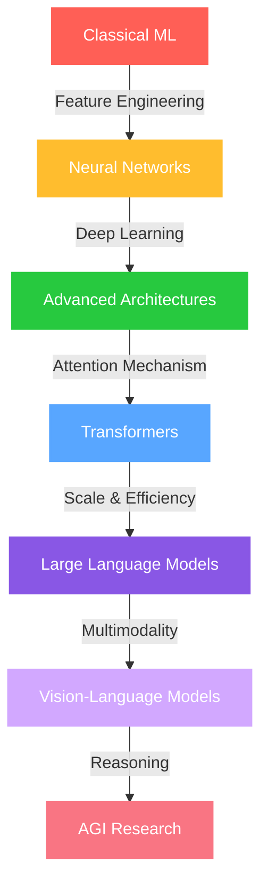

<div align="center">
  
</div>

<div align="center">
  
  
</div>

<div align="center">
  <a href="https://www.linkedin.com/in/mandrita-dasgupta-00a8a428b">
    
  </a>
  <a href="https://twitter.com/mandrita16">
    
  </a>
  <a href="mailto:mandritadasgupta16@gmail.com">
    
  </a>
</div>


## 🤖 About Me

```python
class MandritaDasgupta:
    def __init__(self):
        self.name = "Mandrita Dasgupta"
        self.education = "Computer Science and  Engineering @ Heritage Institute Of Technology"
        self.interests = ["Artificial General Intelligence", 
                          "Natural Language Processing", 
                          "Neural Networks", 
                          "Deep Learning"]
        self.research_focus = "Creating intelligent systems that understand human cognition"
        self.work_philosophy = "Building AI that augments human potential"
        
    def current_ventures(self):
        return "Exploring the frontiers of transformer architectures and multimodal models"
        
    def life_mission(self):
        return "Advancing the field of AI to create systems that benefit humanity"
```

## 🧠 AI & ML Tech Arsenal

<div align="center">
  <table>
    <tr>
      <td valign="top" width="33%">
        <h3 align="center">Machine Learning</h3>
        <div align="center">  
            
            
            
          
          
        </div>
      </td>
      <td valign="top" width="33%">
        <h3 align="center">NLP & Data</h3>
        <div align="center">  
            
            
          
            
          
        </div>
      </td>
      <td valign="top" width="33%">
        <h3 align="center">Web & Cloud</h3>
        <div align="center">  
            
            
          
          
          
        </div>
      </td>
    </tr>
  </table>
</div>

## 🚀 Current AI Explorations

<div align="center">
  
</div>

- 🧠 **Neural Networks Evolution**: Pushing the boundaries of neural architecture design
- 🔮 **Self-Supervised Learning**: Exploring methods for learning without labeled data
- 🌐 **Multimodal Deep Learning**: Combining vision and language understanding
- 🤖 **Reinforcement Learning**: Training agents through innovative reward systems
- 🔍 **Attention Mechanisms**: Advancing context understanding in language models

## 📊 My AI Journey Visualization



## 💻 Code Metrics

<!-- GitHub Activity Graph -->
<div align="center">
  
</div>

<!-- GitHub Streak Stats -->
<div align="center" style="margin-top: 20px;">
  
</div>

<!-- GitHub Profile Trophy -->
<div align="center" style="margin-top: 20px;">
  
</div>


<div align="center">  </div> 

## 🎃 Hacktoberfest Highlights & Holopin Honors

[](https://holopin.io/@mandrita16)


<div align="center">
  
</div>

<div align="center">
  
</div>
