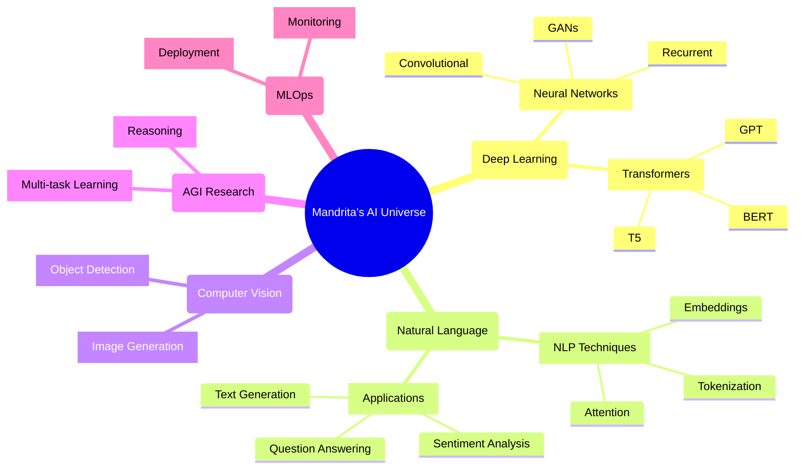

<div align="center">
  
</div>

<h1 align="center">
  
</h1>

<p align="center">
  
</p>

<div align="center">
  <a href="https://www.linkedin.com/in/mandrita-dasgupta-00a8a428b">
    
  </a>
  <a href="https://twitter.com/mandrita16">
    
  </a>
  <a href="mailto:mandritadasgupta16@gmail.com">
    
  </a>
</div>

<div align="center">
  <br>
  
</div>

<br>

<table>
  <tr>
    <td width="58%">
      <h2>🧠 Neural Biography</h2>
      
      
```python
class MandritaDasgupta:
    def __init__(self):
        self.name = "Mandrita Dasgupta"
        self.role = "AI & ML Specialist"
        self.education = "CS Engineering @ Heritage Institute"
        self.location = "Neural Network Layer 7"
        
    def technical_focus(self):
        return {
            "research": ["NLP", "Deep Learning", "Transformers"],
            "models": ["BERT", "GPT", "Diffusion Models"],
            "vision": "Building sentient AI that understands context"
        }
        
    def current_quests(self):
        return [
            "Training models that comprehend human emotion",
            "Researching efficient attention mechanisms",
            "Developing multilingual understanding systems"
        ]
```
    </td>
    <td width="42%">
      <h2>⚡ Power Metrics</h2>
      
      
    </td>
  </tr>
</table>

<h2 align="center">🔮 Neural Architecture</h2>



<h2 align="center">🧪 AI Laboratory Equipment</h2>

<div align="center">
  <table>
    <tr>
      <td>
        <h3 align="center">🤖 AI Core</h3>
        <div align="center">
          
          
          
          
          
        </div>
      </td>
      <td>
        <h3 align="center">🧬 NLP DNA</h3>
        <div align="center">
          
          
          
          
          
        </div>
      </td>
    </tr>
    <tr>
      <td>
        <h3 align="center">⚙️ Tools & Engines</h3>
        <div align="center">
          
          
          
          
          
        </div>
      </td>
      <td>
        <h3 align="center">☁️ Cloud Nexus</h3>
        <div align="center">
          
          
          
          
        </div>
      </td>
    </tr>
  </table>
</div>

<h2 align="center">🌠 AI Skill Matrix</h2>

<div align="center">
  <table>
    <tr>
      <td>Deep Learning</td>
      <td>
        
      </td>
      <td>95%</td>
    </tr>
    <tr>
      <td>Natural Language Processing</td>
      <td>
        
      </td>
      <td>90%</td>
    </tr>
    <tr>
      <td>Machine Learning</td>
      <td>
        
      </td>
      <td>87%</td>
    </tr>
    <tr>
      <td>Computer Vision</td>
      <td>
        
      </td>
      <td>80%</td>
    </tr>
    <tr>
      <td>Web Development</td>
      <td>
        
      </td>
      <td>75%</td>
    </tr>
    <tr>
      <td>MLOps & Deployment</td>
      <td>
        
      </td>
      <td>70%</td>
    </tr>
  </table>
</div>

<h2 align="center">🚀 Neural Network Projects</h2>

<div align="center">
  <table>
    <tr>
      <td width="50%">
        <h3 align="center">Emotion Detection NLP</h3>
        <div align="center">
          <a href="https://github.com/mandrita16/emotion-detection" target="_blank">
            
          </a>
          <p>
            <a href="https://github.com/mandrita16/emotion-detection" target="_blank">
              
            </a>
          </p>
          <p><strong>PyTorch, Transformers, BERT</strong> - Advanced NLP model for detecting emotions in text with fine-tuned transformer architecture</p>
        </div>
      </td>
      <td width="50%">
        <h3 align="center">Multimodal Learning System</h3>
        <div align="center">
          <a href="https://github.com/mandrita16/multimodal-learning" target="_blank">
            
          </a>
          <p>
            <a href="https://github.com/mandrita16/multimodal-learning" target="_blank">
              
            </a>
          </p>
          <p><strong>TensorFlow, CNN, RNN, Transformers</strong> - Model that combines visual and textual inputs for comprehensive understanding</p>
        </div>
      </td>
    </tr>
  </table>
</div>

<h2 align="center">🌌 AI Research Trajectory</h2>

<div align="center">
  
</div>

<br>

<h2 align="center">📬 Neural Connection Ports</h2>

<div align="center">
  <a href="https://www.linkedin.com/in/mandrita-dasgupta-00a8a428b">
    
  </a>
  <a href="https://twitter.com/mandrita16">
    
  </a>
  <a href="mailto:mandritadasgupta16@gmail.com">
    
  </a>
</div>

<div align="center">
  
</div>
