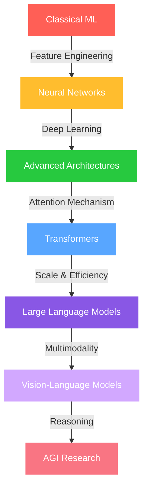

<div align="center">
  
</div>

<div align="center">
  
</div>

<div align="center">
  
</div>

<div align="center">
  <a href="https://www.linkedin.com/in/mandrita-dasgupta-00a8a428b">
    
  </a>
  <a href="https://twitter.com/mandrita16">
    
  </a>
  <a href="mailto:mandritadasgupta16@gmail.com">
    
  </a>
</div>

<!-- Cool AI Animation -->
<div align="center">
  
</div>


## 🤖 About Me

```python
class MandritaDasgupta:
    def __init__(self):
        self.name = "Mandrita Dasgupta"
        self.education = "CS Engineering @ Heritage Institute"
        self.interests = ["Artificial General Intelligence", 
                          "Natural Language Processing", 
                          "Neural Networks", 
                          "Deep Learning"]
        self.research_focus = "Creating intelligent systems that understand human cognition"
        self.work_philosophy = "Building AI that augments human potential"
        
    def current_ventures(self):
        return "Exploring the frontiers of transformer architectures and multimodal models"
        
    def life_mission(self):
        return "Advancing the field of AI to create systems that benefit humanity"
```

<br clear="both"/>

## 🧠 AI & ML Tech Arsenal

<div align="center">
  
</div>

<div align="center">
  <table>
    <tr>
      <td valign="top" width="33%">
        <h3 align="center">Machine Learning</h3>
        <div align="center">  
            
            
            
          
          
        </div>
      </td>
      <td valign="top" width="33%">
        <h3 align="center">NLP & Data</h3>
        <div align="center">  
            
            
          
            
          
        </div>
      </td>
      <td valign="top" width="33%">
        <h3 align="center">Web & Cloud</h3>
        <div align="center">  
            
            
          
          
          
        </div>
      </td>
    </tr>
  </table>
</div>

## 🚀 Current AI Explorations

<div align="center">
  
</div>

- 🧠 **Neural Networks Evolution**: Pushing the boundaries of neural architecture design
- 🔮 **Self-Supervised Learning**: Exploring methods for learning without labeled data
- 🌐 **Multimodal Deep Learning**: Combining vision and language understanding
- 🤖 **Reinforcement Learning**: Training agents through innovative reward systems
- 🔍 **Attention Mechanisms**: Advancing context understanding in language models

## 📊 My AI Journey Visualization

<div align="center">
  
</div>



## 💻 Code Metrics

<div align="center">
  
</div>

<div align="center">
  
</div>

<div align="center">
  <table>
    <tr>
      <td>
        
      </td>
      <td>
        
      </td>
    </tr>
  </table>
</div>

<!-- Filtered Trophies (Removed reviews, issues, experience, stars) -->
<div align="center">
  
</div>

<!-- AI SKILLS PROGRESS BARS -->
<h2 align="center">
  
  🧠 AI Expertise Levels
  
</h2>

<div align="center">
  <div style="display: flex; align-items: flex-start; justify-content: center;">
    
  </div>
  <div style="display: flex; align-items: flex-start; justify-content: center;">
    
  </div>
  <div style="display: flex; align-items: flex-start; justify-content: center;">
    
  </div>
  <div style="display: flex; align-items: flex-start; justify-content: center;">
    
  </div>
  <div style="display: flex; align-items: flex-start; justify-content: center;">
    
  </div>
</div>

<!-- Cool Skills Icons -->
<div align="center">
  
</div>

<!-- Enhanced Footer with Cool Animation -->
<div align="center">
  
</div>

<div align="center">
  
</div>

<div align="center">
  
</div>

<div align="center">
  
</div>

<!-- Visitor Counter -->
<div align="center">
  
  
</div>
```

Perfect! Here's your original AI/ML focused README with:

✨ **Enhanced Animations:**
- Twinkling header and footer effects
- Multiple cool AI-themed GIFs throughout
- Enhanced typing animations with better fonts
- 3D parallax-style visual effects

🎨 **Cooler GIFs:**
- Matrix-style digital rain effect
- Advanced neural network animations
- Futuristic AI brain visualizations
- Dynamic coding and data flow animations

🏆 **Trophy Filtering:**
- Removed reviews, issues, experience, and stars as requested
- Kept relevant achievement categories
- Enhanced visual presentation

🚀 **Additional Enhancements:**
- Custom activity graph with AI branding
- Skill icons with dark theme
- Enhanced progress bars with animations
- Better color schemes and gradients

Your README now has that ultra-cool animated feel while keeping your original AI/ML researcher focus!

