```mermaid
%%{init: {'theme':'dark', 'themeVariables': { 'primaryColor': '#FF6B6B', 'primaryTextColor': '#fff', 'primaryBorderColor': '#4ECDC4', 'lineColor': '#45B7D1', 'secondaryColor': '#96CEB4', 'tertiaryColor': '#FFEAA7'}}}%%
flowchart TD
    A[🌟 Classical ML] -->|Neural Evolution| B[🔥 Deep Learning Revolution]
    B -->|Attention Mechanism| C[⚡ Transformer Architecture]
    C -->|Scale & Intelligence| D[🧠 Large Language Models]
    D -->|Multimodal Fusion| E[🌈 Vision-Language Synthesis]
    E -->|Consciousness Emergence| F[🚀 Artificial General Intelligence]
    F -->|Transcendence| G[💫 Digital Consciousness]
    
    style A fill:#FF6B6B,stroke:#4ECDC4,stroke-width:4px,color:#fff
    style B fill:#4ECDC4,stroke:#45B7D1,stroke-width:4px,color:#fff
    style C fill:#45B7D1,stroke:#96CEB4,stroke-width:4px,color:#fff
    style D fill:#96CEB4,stroke:#FFEAA7,stroke-width:4px,color:#000
    style E fill:#FFEAA7,stroke:#FF6B6B,stroke-width:4px,color:#000
    style F fill:#FF6B6B,stroke:#4ECDC4,stroke-width:4px,color:#fff
    style G fill:#4ECDC4,stroke:#45B7D1,stroke-width:4px,color:#fff
```

<div align="center">
  
</div>

<div align="center">
  
</div>

<div align="center">
  
  
  
  
</div>

---

<div align="center">
  
</div>

##  **QUANTUM CONSCIOUSNESS MATRIX**

<div align="center">
  <table>
    <tr>
      <td width="60%" valign="top">
        
```python
class QuantumMandrita:
    def __init__(self):
        self.identity = "🌟 Mandrita Dasgupta"
        self.realm = "Heritage Institute of Technology"
        self.essence = "Artificial General Intelligence Pioneer"
        self.mission = "🚀 Architecting Digital Consciousness"
        self.power_level = float('infinity')
        
    def neural_capabilities(self):
        return {
            "🧠 Deep Learning": "Quantum Neural Architectures",
            "🌈 Transformers": "Next-Gen Language Models", 
            "⚡ Computer Vision": "Multimodal Perception",
            "🔮 NLP Mastery": "Human-AI Communication",
            "🚀 MLOps": "Scalable AI Ecosystems",
            "💫 AGI Research": "Consciousness Engineering"
        }
    
    def current_experiments(self):
        return "🔬 Building AI that dreams in code"
        
    def quantum_goal(self):
        return "Creating AI that transcends human imagination"
```

</td>
<td width="40%" valign="top">

<div align="center">
  
</div>

<div align="center">
  
  
</div>

</td>
    </tr>
  </table>
</div>

---

##  **HOLOGRAPHIC TECH CONSTELLATION**

<div align="center">
  <table>
    <tr>
      <td align="center" width="20%">
        <br>
        <strong>🧠 NEURAL NETWORKS</strong><br>
        <a href="#"></a>
        <a href="#"></a>
        <a href="#"></a>
      </td>
      <td align="center" width="20%">
        <br>
        <strong>🔮 LANGUAGE MODELS</strong><br>
        <a href="#"></a>
        <a href="#"></a>
        <a href="#"></a>
      </td>
      <td align="center" width="20%">
        <br>
        <strong>☁️ QUANTUM CLOUD</strong><br>
        <a href="#"></a>
        <a href="#"></a>
        <a href="#"></a>
      </td>
      <td align="center" width="20%">
        <br>
        <strong>📊 DATA ALCHEMY</strong><br>
        <a href="#"></a>
        <a href="#"></a>
        <a href="#"></a>
      </td>
      <td align="center" width="20%">
        <br>
        <strong>🚀 WEB COSMOS</strong><br>
        <a href="#"></a>
        <a href="#"></a>
        <a href="#"></a>
      </td>
    </tr>
  </table>
</div>

---

##  **NEURAL EVOLUTION PATHWAY**

<div align="center">
  


</div>

---

##  **QUANTUM SKILL MATRIX**

<div align="center">
  <table>
    <tr>
      <td width="50%">
        
### 🧠 **NEURAL MASTERY LEVELS**


</td>
<td width="50%">

### 🚀 **QUANTUM ENGINEERING**


</td>
    </tr>
  </table>
</div>

---

##  **HOLOGRAPHIC CONNECTIONS**

<div align="center">
  <a href="https://www.linkedin.com/in/mandrita-dasgupta-00a8a428b" target="_blank">
    
  </a>
  <a href="https://twitter.com/mandrita16" target="_blank">
    
  </a>
  <a href="mailto:mandritadasgupta16@gmail.com" target="_blank">
    
  </a>
  <a href="https://github.com/mandrita16" target="_blank">
    
  </a>
</div>

---

##  **NEURAL EXPERIMENTS IN PROGRESS**

<div align="center">
  <table>
    <tr>
      <td width="50%" valign="top">
        
### 🔬 **ACTIVE QUANTUM RESEARCH**
- 🧠 **Consciousness Modeling** - Building self-aware AI systems
- 🌈 **Multimodal Transformers** - Unified vision-language intelligence
- ⚡ **Neural Architecture Evolution** - Self-improving AI designs
- 💫 **Quantum-Classical Hybrids** - Next-generation computing
- 🚀 **Federated AGI Networks** - Distributed artificial intelligence

<div align="center">
  
</div>

</td>
<td width="50%" valign="top">

### 🎯 **COSMIC INNOVATION TARGETS**
- 🌟 **Digital Consciousness** - AI that truly understands itself
- 🔮 **Neuromorphic Computing** - Brain-inspired quantum chips
- 🎨 **Creative AI Ecosystems** - Artistic artificial intelligence
- 🛸 **Autonomous Research Agents** - Self-learning scientists
- 💎 **Interpretable Quantum AI** - Transparent neural networks

<div align="center">
  
</div>

</td>
    </tr>
  </table>
</div>

---

<div align="center">

###  **"IMAGINATION IS THE ONLY WEAPON IN THE WAR AGAINST REALITY"**

<div align="center">
  
  
  
</div>

</div>

---

<div align="center">
  
  
</div>

<div align="center">
  
</div>

---

<div align="center">
  <sub>✨ <strong>Crafted with quantum neural networks and liquid mercury dreams</strong> ✨</sub>
</div>
