```mermaid
%%{init: {'theme':'dark', 'themeVariables': { 'primaryColor': '#667eea', 'primaryTextColor': '#fff', 'primaryBorderColor': '#764ba2', 'lineColor': '#f093fb', 'secondaryColor': '#667eea', 'tertiaryColor': '#764ba2'}}}%%
flowchart TD
    A[🧠 Classical ML] -->|Neural Evolution| B[🔥 Deep Learning]
    B -->|Attention Revolution| C[🚀 Transformers]
    C -->|Scale & Efficiency| D[⚡ Large Language Models]
    D -->|Multimodal Fusion| E[🌐 Vision-Language Models]
    E -->|Reasoning & Logic| F[🔮 Artificial General Intelligence]
    
    style A fill:#667eea,stroke:#764ba2,stroke-width:3px,color:#fff
    style B fill:#f093fb,stroke:#667eea,stroke-width:3px,color:#fff
    style C fill:#764ba2,stroke:#f093fb,stroke-width:3px,color:#fff
    style D fill:#667eea,stroke:#764ba2,stroke-width:3px,color:#fff
    style E fill:#f093fb,stroke:#667eea,stroke-width:3px,color:#fff
    style F fill:#764ba2,stroke:#f093fb,stroke-width:3px,color:#fff
```

<div align="center">
  
</div>

<div align="center">
  
</div>

---

<div align="center">
  
  
</div>

##  **NEURAL NETWORK ARCHITECT**

<div align="center">
  <table>
    <tr>
      <td width="50%" valign="top">
        
```python
class MandritaDasgupta:
    def __init__(self):
        self.role = "AI Engineer & ML Researcher"
        self.institution = "Heritage Institute of Technology"
        self.passion = "Artificial General Intelligence"
        self.mission = "Building minds that think"
        
    def expertise(self):
        return {
            "🧠 Neural Networks": "Advanced Architectures",
            "🔮 Deep Learning": "Transformer Innovations", 
            "🌐 NLP": "Language Understanding",
            "🚀 MLOps": "Scalable AI Systems",
            "⚡ Research": "AGI Exploration"
        }
    
    def current_focus(self):
        return "Multimodal AI & Self-Supervised Learning"
        
    def dream(self):
        return "Creating AI that augments human potential"
```

</td>
<td width="50%" valign="top">

<div align="center">
  
</div>

<div align="center">
  
</div>

</td>
    </tr>
  </table>
</div>

---

##  **AI TECH CONSTELLATION**

<div align="center">
  <table>
    <tr>
      <td align="center" width="25%">
        <br>
        <strong>🧠 DEEP LEARNING</strong><br>
        
        
        
      </td>
      <td align="center" width="25%">
        <br>
        <strong>🔮 NLP & LLMs</strong><br>
        
        
        
      </td>
      <td align="center" width="25%">
        <br>
        <strong>☁️ CLOUD & MLOps</strong><br>
        
        
        
      </td>
      <td align="center" width="25%">
        <br>
        <strong>📊 DATA SCIENCE</strong><br>
        
        
        
      </td>
    </tr>
  </table>
</div>

---

##  **NEURAL PATHWAY TO AGI**

<div align="center">
  


</div>

---

##  **NEURAL ACTIVITY MATRIX**

<div align="center">
  
</div>

<div align="center">
  
</div>

---

##  **AI MASTERY NEURAL NETWORK**

<div align="center">
  <table>
    <tr>
      <td width="50%">
        
### 🧠 **DEEP LEARNING EXPERTISE**


</td>
<td width="50%">

### 🔮 **AI ENGINEERING SKILLS**


</td>
    </tr>
  </table>
</div>

---

##  **QUANTUM CONNECTIONS**

<div align="center">
  <a href="https://www.linkedin.com/in/mandrita-dasgupta-00a8a428b" target="_blank">
    
  </a>
  <a href="https://twitter.com/mandrita16" target="_blank">
    
  </a>
  <a href="mailto:mandritadasgupta16@gmail.com" target="_blank">
    
  </a>
  <a href="https://github.com/mandrita16" target="_blank">
    
  </a>
</div>

---

##  **NEURAL ACHIEVEMENTS UNLOCKED**

<div align="center">
  
</div>

---

##  **CURRENT NEURAL EXPERIMENTS**

<div align="center">
  <table>
    <tr>
      <td width="50%" valign="top">
        
### 🔬 **ACTIVE RESEARCH**
- 🧠 **Multimodal Transformers** - Bridging vision and language
- 🔮 **Self-Supervised Learning** - Learning without labels
- ⚡ **Neural Architecture Search** - Evolving AI architectures
- 🌐 **Federated Learning** - Distributed AI intelligence
- 🚀 **Quantum-Classical Hybrid Models** - Next-gen computing

</td>
<td width="50%" valign="top">

### 🎯 **INNOVATION TARGETS**
- 🔬 **AGI Foundations** - Building general intelligence
- 🧬 **Neuromorphic Computing** - Brain-inspired chips
- 🌟 **Consciousness Modeling** - Understanding awareness
- 🎨 **Creative AI Systems** - Artistic intelligence
- 🔒 **Interpretable AI** - Explainable neural networks

</td>
    </tr>
  </table>
</div>

---

<div align="center">

###  **"THE FUTURE BELONGS TO THOSE WHO BUILD IT"**


</div>

---

<div align="center">
  
  
</div>

<div align="center">
  
</div>

---

<div align="center">
  <sub>✨ <strong>Crafted with neural networks and quantum dreams</strong> ✨</sub>
</div>
