<div align="center">
  
</div>

<!-- 3D Floating Animation Header -->
<div align="center">
  
</div>

<div align="center">
  
</div>

<!-- Enhanced Social Links with 3D Effect -->
<div align="center">
  <a href="https://www.linkedin.com/in/mandrita-dasgupta-00a8a428b">
    
  </a>
  <a href="https://twitter.com/mandrita16">
    
  </a>
  <a href="mailto:mandritadasgupta16@gmail.com">
    
  </a>
</div>

<br/>

<!-- 3D Parallax Divider -->
<div align="center">
  
</div>

<!-- Enhanced About Section with Legal Background -->


## 🤖⚖️ About Me

```python
class MandritaDasgupta:
    def __init__(self):
        self.name = "Mandrita Dasgupta"
        self.primary_role = "AI Engineer & ML Researcher"
        self.secondary_expertise = "Legal Technology Innovation"
        self.education = "CS Engineering @ Heritage Institute"
        self.legal_background = "Legal Tech & AI Ethics Specialist"
        
        # Dual Expertise
        self.ai_interests = [
            "Artificial General Intelligence", 
            "Natural Language Processing", 
            "Neural Networks", 
            "Deep Learning",
            "Legal Document Analysis",
            "AI Ethics & Compliance"
        ]
        
        self.legal_tech_focus = [
            "Contract Analysis AI",
            "Legal Research Automation",
            "Compliance Monitoring Systems",
            "Judicial Decision Prediction",
            "Legal Document Generation"
        ]
        
        self.research_focus = "Creating intelligent systems that understand human cognition and legal reasoning"
        self.work_philosophy = "Building AI that augments human potential while ensuring ethical compliance"
        
    def current_ventures(self):
        return {
            "ai_research": "Exploring transformer architectures for legal document understanding",
            "legal_tech": "Developing AI systems for legal practice automation",
            "ethics": "Ensuring AI compliance with legal and ethical standards"
        }
        
    def life_mission(self):
        return "Advancing AI to create systems that benefit humanity while upholding justice and ethics"
        
    def unique_value_proposition(self):
        return "Bridging the gap between cutting-edge AI technology and legal expertise"
```

<br clear="both"/>

<!-- 3D Tech Arsenal with Legal Tech Integration -->
## 🧠⚖️ AI & Legal Tech Arsenal

<div align="center">
  
</div>

<div align="center">
  <table>
    <tr>
      <td valign="top" width="25%">
        <h3 align="center">🧠 Machine Learning</h3>
        <div align="center">  
            
            
            
          
          
        </div>
      </td>
      <td valign="top" width="25%">
        <h3 align="center">🔤 NLP & Legal AI</h3>
        <div align="center">  
            
            
          
          
          
        </div>
      </td>
      <td valign="top" width="25%">
        <h3 align="center">📊 Data & Analytics</h3>
        <div align="center">  
            
          
          
          
          
        </div>
      </td>
      <td valign="top" width="25%">
        <h3 align="center">☁️ Web & Cloud</h3>
        <div align="center">  
            
            
          
          
          
        </div>
      </td>
    </tr>
  </table>
</div>

<!-- 3D Animated Current Explorations -->
## 🚀⚖️ Current AI & Legal Tech Explorations

<div align="center">
  
</div>

<div align="center">
  <table>
    <tr>
      <td width="50%">
        <h3>🧠 AI Research Focus</h3>
        <ul>
          <li>🔬 <strong>Neural Networks Evolution</strong>: Pushing the boundaries of neural architecture design</li>
          <li>🔮 <strong>Self-Supervised Learning</strong>: Exploring methods for learning without labeled data</li>
          <li>🌐 <strong>Multimodal Deep Learning</strong>: Combining vision and language understanding</li>
          <li>🤖 <strong>Reinforcement Learning</strong>: Training agents through innovative reward systems</li>
          <li>🔍 <strong>Attention Mechanisms</strong>: Advancing context understanding in language models</li>
        </ul>
      </td>
      <td width="50%">
        <h3>⚖️ Legal Tech Innovation</h3>
        <ul>
          <li>📋 <strong>Contract Intelligence</strong>: AI-powered contract analysis and risk assessment</li>
          <li>🔍 <strong>Legal Research Automation</strong>: Intelligent case law and precedent discovery</li>
          <li>⚡ <strong>Compliance Monitoring</strong>: Real-time regulatory compliance tracking</li>
          <li>🎯 <strong>Predictive Legal Analytics</strong>: Outcome prediction for legal cases</li>
          <li>📝 <strong>Document Generation</strong>: Automated legal document creation and review</li>
        </ul>
      </td>
    </tr>
  </table>
</div>

<!-- Enhanced 3D Journey Visualization -->
## 📊⚖️ My AI & Legal Tech Journey Visualization

```mermaid
graph TD
    A["🎓 Classical ML & Legal Studies"] -->|Feature Engineering + Legal Research| B["🧠 Neural Networks + Legal Analytics"]
    B -->|Deep Learning + Case Analysis| C["🔥 Advanced Architectures + Legal AI"]
    C -->|Attention Mechanism + Document Understanding| D["🤖 Transformers + Legal NLP"]
    D -->|Scale & Legal Data| E["📚 Large Language Models + Legal Knowledge"]
    E -->|Vision + Language + Legal Documents| F["👁️ Multimodal AI + Legal Tech"]
    F -->|Reasoning + Legal Logic| G["🌟 AGI Research + Legal Intelligence"]
    
    style A fill:#8B0000,stroke:#8B0000,color:white,stroke-width:3px
    style B fill:#4B0082,stroke:#4B0082,color:white,stroke-width:3px
    style C fill:#2F4F4F,stroke:#2F4F4F,color:white,stroke-width:3px
    style D fill:#800080,stroke:#800080,color:white,stroke-width:3px
    style E fill:#ff5f56,stroke:#ff5f56,color:white,stroke-width:3px
    style F fill:#ffbd2e,stroke:#ffbd2e,color:white,stroke-width:3px
    style G fill:#27c93f,stroke:#27c93f,color:white,stroke-width:3px
```

<div align="center">
  
</div>



<!-- Enhanced 3D Code Metrics -->
## 💻 Code Metrics & Development Activity

<div align="center">
  
</div>

<div align="center">
  
</div>

<div align="center">
  <table>
    <tr>
      <td>
        
      </td>
      <td>
        
      </td>
    </tr>
  </table>
</div>

<!-- Filtered Trophy Display (Removed reviews, issues, experience, stars as requested) -->
<div align="center">
  
</div>

<!-- Enhanced AI & Legal Expertise Levels with 3D Effects -->
<h2 align="center">
  
  🧠⚖️ AI & Legal Tech Expertise Matrix
  
</h2>

<div align="center">
  <table>
    <tr>
      <td width="50%">
        <h4>🧠 AI & ML Expertise</h4>
        
        
        
        
        
      </td>
      <td width="50%">
        <h4>⚖️ Legal Tech Expertise</h4>
        
        
        
        
        
      </td>
    </tr>
  </table>
</div>

<!-- 3D Parallax Skills Visualization -->
<div align="center">
  
</div>

<br/>

<!-- Enhanced Legal Tech Focus Areas -->
<h2 align="center">
  
  ⚖️🤖 Legal AI Innovation Areas
  
</h2>

<div align="center">
  <table>
    <tr>
      <td width="33%">
        <h4>📋 Contract Intelligence</h4>
        <ul>
          <li>🔍 Automated contract review</li>
          <li>⚠️ Risk assessment algorithms</li>
          <li>📊 Clause analysis & extraction</li>
          <li>🎯 Compliance verification</li>
        </ul>
      </td>
      <td width="33%">
        <h4>🔬 Legal Research AI</h4>
        <ul>
          <li>📚 Case law discovery</li>
          <li>🎯 Precedent matching</li>
          <li>📈 Legal trend analysis</li>
          <li>🤖 Automated legal briefs</li>
        </ul>
      </td>
      <td width="33%">
        <h4>⚡ Predictive Analytics</h4>
        <ul>
          <li>🎲 Case outcome prediction</li>
          <li>📊 Settlement probability</li>
          <li>⏱️ Timeline estimation</li>
          <li>💰 Cost analysis modeling</li>
        </ul>
      </td>
    </tr>
  </table>
</div>

<!-- 3D Animated Professional Philosophy -->
<h2 align="center">
  
  🌟 Professional Philosophy & Vision
  
</h2>

<div align="center">
  
</div>

<div align="center">
  <table>
    <tr>
      <td>
        <h4>🎯 Mission</h4>
        <p>To revolutionize the legal industry through ethical AI innovation while ensuring justice, fairness, and accessibility for all.</p>
      </td>
      <td>
        
      </td>
    </tr>
  </table>
</div>

<!-- Enhanced 3D Footer Animation -->
<div align="center">
  
</div>

<div align="center">
  
</div>

<!-- 3D Parallax Footer -->
<div align="center">
  
</div>

<!-- Visitor Counter with Enhanced Design -->
<div align="center">
  
  
</div>

<!-- Hidden Legal AI ASCII Art -->
<!--
    ╔══════════════════════════════════════════════════════════════════╗
    ║                                                                  ║
    ║   ⚖️ MANDRITA DASGUPTA - AI ENGINEER & LEGAL TECH INNOVATOR ⚖️    ║
    ║                                                                  ║
    ║   🧠 Building the future of AI-powered legal systems            ║
    ║   🤖 Neural networks meet legal intelligence                    ║
    ║   ⚖️ Justice through technology innovation                       ║
    ║   🌟 Ethical AI for legal transformation                        ║
    ║                                                                  ║
    ╚══════════════════════════════════════════════════════════════════╝
-->
```

This ultra-animated README features:

🎨 **Enhanced 3D Visual Effects:**
- Advanced parallax-style animations
- 3D floating headers with twinkling effects
- Dynamic gradient transitions
- Multiple layered animated GIFs

⚖️ **Legal Tech Integration:**
- Dual AI Engineer + Legal Tech expertise
- Contract intelligence and legal AI focus
- Legal document analysis capabilities
- Compliance and ethics emphasis

🚀 **Advanced Animations:**
- Custom typing animations with legal tech themes
- 3D skill matrices and progress bars
- Enhanced mermaid diagrams with legal journey
- Parallax scrolling effects

🏆 **Filtered Trophy Display:**
- Removed reviews, issues, experience, and stars as requested
- Kept relevant achievement categories
- Enhanced visual presentation

📊 **Enhanced Metrics:**
- Custom activity graphs with legal tech branding
- Dual expertise progress bars (AI + Legal)
- Professional philosophy section
- Legal innovation focus areas

The profile now showcases your unique combination of AI engineering expertise and legal technology innovation, with advanced 3D animations and parallax effects throughout!

