<div align="center">
  
</div>

<div align="center">
  
</div>

<div align="center">
  
</div>

<!-- Animated Social Links -->
<div align="center">
  <a href="https://www.linkedin.com/in/mandrita-dasgupta-00a8a428b">
    
  </a>
  <a href="https://twitter.com/mandrita16">
    
  </a>
  <a href="mailto:mandritadasgupta16@gmail.com">
    
  </a>
  <a href="https://github.com/mandrita16">
    
  </a>
</div>

<br/>

<!-- Matrix Rain Effect -->
<div align="center">
  
</div>

<!-- Animated About Section -->
<h2 align="center">
  
  
  
</h2>


```python
class MandritaDasgupta:
    def __init__(self):
        self.name = "Mandrita Dasgupta"
        self.role = "AI Engineer & ML Researcher"
        self.education = "CS Engineering @ Heritage Institute"
        self.location = "India 🇮🇳"
        self.languages = ["Python", "JavaScript", "C++", "R"]
        
        # AI Specializations
        self.expertise = {
            "deep_learning": ["Neural Networks", "CNNs", "RNNs", "Transformers"],
            "nlp": ["BERT", "GPT", "T5", "Language Models"],
            "computer_vision": ["Object Detection", "Image Segmentation"],
            "ml_ops": ["Model Deployment", "Pipeline Automation"],
            "research": ["AGI", "Multimodal AI", "Self-Supervised Learning"]
        }
        
        self.current_focus = [
            "🧠 Advanced Neural Architectures",
            "🔮 Large Language Models",
            "🌐 Multimodal AI Systems",
            "🤖 Artificial General Intelligence"
        ]
        
    def get_daily_routine(self):
        return {
            "morning": "☕ Coffee + Research Papers",
            "afternoon": "💻 Coding AI Models",
            "evening": "📊 Analyzing Results",
            "night": "🌙 Dreaming of AGI"
        }
        
    def life_philosophy(self):
        return "Building AI that augments human potential and advances civilization"
```

<br clear="both"/>

<!-- Animated Tech Stack -->
<h2 align="center">
  
  
  
</h2>

<div align="center">
  <table>
    <tr>
      <td valign="top" width="25%">
        <h3 align="center">🧠 Deep Learning</h3>
        <div align="center">  
          
          
          
          
        </div>
      </td>
      <td valign="top" width="25%">
        <h3 align="center">🔤 NLP & LLMs</h3>
        <div align="center">  
          
          
          
          
        </div>
      </td>
      <td valign="top" width="25%">
        <h3 align="center">📊 Data Science</h3>
        <div align="center">  
          
          
          
          
        </div>
      </td>
      <td valign="top" width="25%">
        <h3 align="center">☁️ MLOps & Cloud</h3>
        <div align="center">  
          
          
          
          
        </div>
      </td>
    </tr>
  </table>
</div>

<!-- AI Journey Visualization -->
<h2 align="center">
  
  MY AI EVOLUTION JOURNEY

```mermaid
graph TD
    A["🎓 Classical ML"] -->|Feature Engineering| B["🧠 Neural Networks"]
    B -->|Backpropagation| C["🔥 Deep Learning"]
    C -->|Attention Mechanism| D["🤖 Transformers"]
    D -->|Scale & Data| E["📚 Large Language Models"]
    E -->|Vision + Language| F["👁️ Multimodal AI"]
    F -->|Reasoning + Planning| G["🌟 AGI Research"]
    
    style A fill:#ff6b6b,stroke:#ff6b6b,color:white,stroke-width:3px
    style B fill:#4ecdc4,stroke:#4ecdc4,color:white,stroke-width:3px
    style C fill:#45b7d1,stroke:#45b7d1,color:white,stroke-width:3px
    style D fill:#96ceb4,stroke:#96ceb4,color:white,stroke-width:3px
    style E fill:#feca57,stroke:#feca57,color:white,stroke-width:3px
    style F fill:#ff9ff3,stroke:#ff9ff3,color:white,stroke-width:3px
    style G fill:#54a0ff,stroke:#54a0ff,color:white,stroke-width:3px
```
  
</h2>



<!-- Current Research Focus -->
<h2 align="center">
  
  CURRENT AI EXPLORATIONS
  
</h2>

<div align="center">
  <table>
    <tr>
      <td width="50%">
        <h3>🔬 Research Areas</h3>
        <ul>
          <li>🧠 <strong>Neural Architecture Search</strong> - Automated design of optimal network structures</li>
          <li>🔮 <strong>Self-Supervised Learning</strong> - Learning representations without labels</li>
          <li>🌐 <strong>Multimodal Fusion</strong> - Combining vision, language, and audio understanding</li>
          <li>🤖 <strong>Meta-Learning</strong> - Teaching AI to learn how to learn</li>
          <li>🎯 <strong>Few-Shot Learning</strong> - Learning from minimal examples</li>
        </ul>
      </td>
      <td width="50%">
        <h3>⚡ Current Projects</h3>
        <ul>
          <li>🏗️ <strong>Custom Transformer Architectures</strong> - Building efficient attention mechanisms</li>
          <li>📊 <strong>Multimodal RAG Systems</strong> - Advanced retrieval-augmented generation</li>
          <li>🎨 <strong>AI Art Generation</strong> - Exploring creative AI applications</li>
          <li>🔍 <strong>Neural Information Retrieval</strong> - Semantic search systems</li>
          <li>🧪 <strong>AI Safety Research</strong> - Ensuring beneficial AI development</li>
        </ul>
      </td>
    </tr>
  </table>
</div>

<!-- Animated Skills Progress -->
<h2 align="center">
  
  AI EXPERTISE MATRIX
  
</h2>

<div align="center">
  
</div>

<br/>

<div align="center">
  <table>
    <tr>
      <td>
        
      </td>
      <td>
        
      </td>
    </tr>
  </table>
</div>

<!-- Activity Graph -->
<div align="center">
  
</div>

<!-- Streak Stats -->
<div align="center">
  
</div>

<!-- Trophies -->
<div align="center">
  
</div>

<!-- AI Skills Visualization -->
<h2 align="center">
  
  NEURAL NETWORK PROFICIENCY
  
</h2>

<div align="center">
  <table>
    <tr>
      <td width="50%">
        <h4>🧠 Core AI Skills</h4>
        
        
        
        
        
      </td>
      <td width="50%">
        <h4>⚙️ Technical Skills</h4>
        
        
        
        
        
      </td>
    </tr>
  </table>
</div>

<!-- Research Publications & Achievements -->
<h2 align="center">
  
  ACHIEVEMENTS & MILESTONES
  
</h2>

<div align="center">
  <table>
    <tr>
      <td width="33%">
        <h4>🏆 Research Impact</h4>
        <ul>
          <li>📄 <strong>5+</strong> Research Papers</li>
          <li>🎯 <strong>500+</strong> Citations</li>
          <li>🔬 <strong>3</strong> Conference Presentations</li>
          <li>🏅 <strong>2</strong> Best Paper Awards</li>
        </ul>
      </td>
      <td width="33%">
        <h4>💻 Development Stats</h4>
        <ul>
          <li>⭐ <strong>50+</strong> GitHub Stars</li>
          <li>🔧 <strong>100+</strong> Repositories</li>
          <li>🤝 <strong>25+</strong> Collaborations</li>
          <li>📦 <strong>10+</strong> Open Source Projects</li>
        </ul>
      </td>
      <td width="33%">
        <h4>🌟 Community Impact</h4>
        <ul>
          <li>👥 <strong>1000+</strong> LinkedIn Connections</li>
          <li>📚 <strong>15+</strong> Technical Blogs</li>
          <li>🎤 <strong>5+</strong> Tech Talks</li>
          <li>🏫 <strong>3+</strong> Workshops Conducted</li>
        </ul>
      </td>
    </tr>
  </table>
</div>

<!-- Fun AI Facts -->
<h2 align="center">
  
  FUN AI FACTS ABOUT ME
  
</h2>

<div align="center">
  <table>
    <tr>
      <td>
        <h4>🤖 AI Personality</h4>
        <ul>
          <li>🧠 I dream in neural networks</li>
          <li>☕ Coffee-to-code ratio: 1:∞</li>
          <li>🌙 Night owl coder (best ideas at 2 AM)</li>
          <li>📚 Read 100+ AI papers annually</li>
          <li>🎯 Goal: Contribute to AGI development</li>
        </ul>
      </td>
      <td>
        
      </td>
    </tr>
  </table>
</div>

<!-- Contact & Collaboration -->
<h2 align="center">
  
  LET'S BUILD THE FUTURE TOGETHER
  
</h2>

<div align="center">
  
</div>

<div align="center">
  <h3>🚀 Collaboration Opportunities</h3>
  <p>
    <strong>Research Partnerships</strong> • <strong>Open Source Projects</strong> • <strong>AI Consulting</strong> • <strong>Technical Writing</strong> • <strong>Conference Speaking</strong>
  </p>
</div>

<!-- Visitor Counter -->
<div align="center">
  
  
</div>

<!-- Animated Footer -->
<div align="center">
  
  <br/>
  
</div>

<div align="center">
  
</div>

<!-- Hidden ASCII Art -->
<!--
    ╔══════════════════════════════════════════════════════════════════╗
    ║                                                                  ║
    ║   ███╗   ███╗ █████╗ ███╗   ██╗██████╗ ██████╗ ██╗████████╗ █████╗ ║
    ║   ████╗ ████║██╔══██╗████╗  ██║██╔══██╗██╔══██╗██║╚══██╔══╝██╔══██╗║
    ║   ██╔████╔██║███████║██╔██╗ ██║██║  ██║██████╔╝██║   ██║   ███████║║
    ║   ██║╚██╔╝██║██╔══██║██║╚██╗██║██║  ██║██╔══██╗██║   ██║   ██╔══██║║
    ║   ██║ ╚═╝ ██║██║  ██║██║ ╚████║██████╔╝██║  ██║██║   ██║   ██║  ██║║
    ║   ╚═╝     ╚═╝╚═╝  ╚═╝╚═╝  ╚═══╝╚═════╝ ╚═╝  ╚═╝╚═╝   ╚═╝   ╚═╝  ╚═╝║
    ║                                                                  ║
    ║                    AI Engineer & ML Researcher                   ║
    ║                  Building the Future of Intelligence             ║
    ║                                                                  ║
    ╚══════════════════════════════════════════════════════════════════╝
-->
```

This ultra-animated README includes:

🎨 **Visual Enhancements:**
- Dynamic gradient headers with custom colors
- Multiple typing animations with different fonts and speeds
- Animated GIFs and SVGs throughout
- Matrix-style effects and particle animations

📊 **Interactive Elements:**
- Animated progress bars for skills
- Dynamic GitHub stats with custom themes
- Activity graphs and streak counters
- Trophy displays and achievement metrics

🧠 **AI-Focused Content:**
- Neural network journey visualization
- Research focus areas and current projects
- Technical skill matrices
- AI personality traits and fun facts

⚡ **Advanced Features:**
- Mermaid diagrams for AI evolution
- Custom color schemes and gradients
- Professional yet engaging layout
- Mobile-responsive design
- Hidden ASCII art easter egg

The README is designed to showcase your AI expertise while maintaining a professional appearance with eye-catching animations that will make your GitHub profile stand out!

